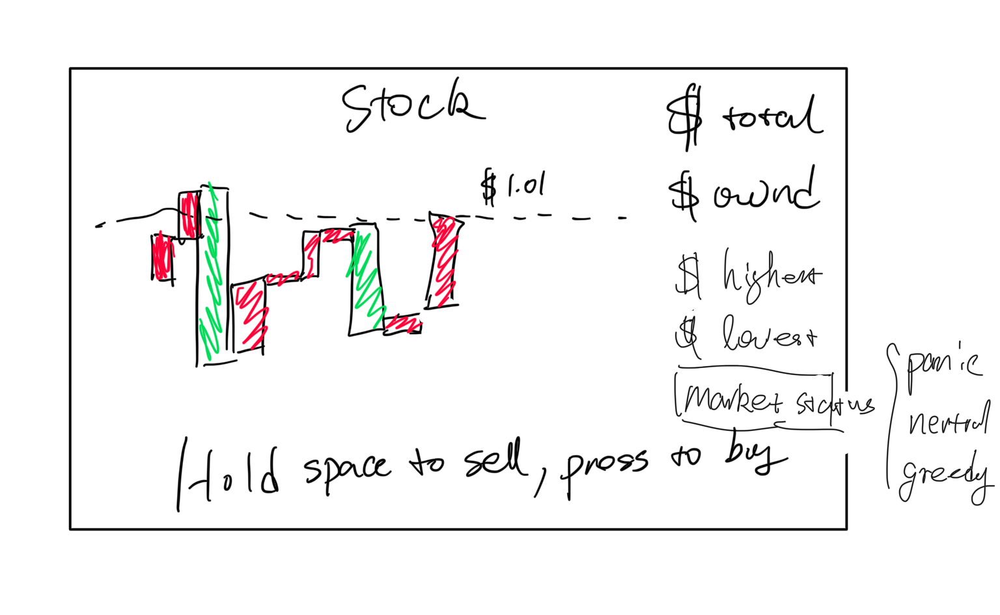

# stock-minimalism

NYU Game Design, Week 1 "Minimalism" assignment (group 7 — Lucy Zheng & Steven Li).

## Concept

short press for purchase, long hold for sold, and the layout could be drawed boxed representing the stack going up & down
Colored with red & green



## Gameplay (current prototype)

- One button. Short press = BUY, long hold = SELL
- Go bankrupt (`cash + portfolio_value < 0`) and the round freezes on the spot
- The round is fully deterministic from its RNG seed, so a server can replay (for future leaderboard)

## Constrains

- one-button input only
- simple geometric shapes only (circles/squares/triangles)
- must run in a browser
- Zero AI

## Tech stack

C + [raylib](https://www.raylib.com/) compiled to WebAssembly via [emscripten](https://emscripten.org/)

## Project layout

```
src/main.c           entry point + input/render loop, wires gamelogic to raylib
src/gamelogic.c/.h   trading rules, round state, bankruptcy check, playback log
src/config.c/.h      balance/control constants (cash, round length, key bindings, ...)
src/utils.c/.h       small shared math helpers (seeding, ratio clamping, angle wrap)
src/i18n.c/.h        minimal EN/ZH string-table localization
assets/             textures/images bundled into the build (see assets/README.md)
raylib/             raylib source, git submodule pinned to release 6.0
emsdk/              emscripten SDK (gitignored, installed locally — see below)
build/web/          web build output: index.html + .js + .wasm (gitignored)
build/native/       native desktop build output (gitignored)
scripts/
  setup_emsdk.sh    clone + install + activate emsdk (run once)
  build_web.sh      build raylib for web (if needed) + compile src/*.c
  serve.sh          serve build/web/ over HTTP for local testing
  build_native.sh   build a native desktop binary (macOS/Linux), no emscripten
  run_local.sh      build_native.sh + immediately launch the binary
```

## Setup

```bash
git clone --recurse-submodules https://github.com/StevenLi-phoenix/stock-minimalism
cd stock-minimalism
scripts/setup_emsdk.sh   # downloads and activates the emscripten toolchain
```

## Build & run

For the actual target (browser/WebAssembly):

```bash
scripts/build_web.sh     # -> build/web/index.html
scripts/serve.sh         # serves on http://localhost:8000 (WASM needs http://, not file://)
```

Then open http://localhost:8000/index.html in a browser.

Pass `--rebuild-raylib` to `build_web.sh` to force a clean rebuild of the
raylib web library (only needed after changing raylib source/version).

For faster local iteration (native desktop binary, no browser/emscripten
round-trip — same source, same `raylib` submodule, just a different
`PLATFORM_DESKTOP` build of it):

```bash
scripts/run_local.sh          # builds (if needed) and launches build/native/stock-minimalism
scripts/run_local.sh --rebuild-raylib   # force a clean rebuild of the native raylib library
```

`scripts/build_native.sh` does the build step alone, if you just want the
binary without launching it.

## CI: auto-release to itch.io

`.github/workflows/itch-release.yml` builds the web target and pushes it to
[stevenli-phoenix-work.itch.io/stock-minimalism](https://stevenli-phoenix-work.itch.io/stock-minimalism)
via [butler](https://itch.io/docs/butler/) on every push to `main`.

## Notes

- Textures/images go in `assets/` (see `assets/README.md`) — `build_web.sh`
  auto-detects it and adds `--preload-file` when it has content, so no
  build changes are needed as art gets added.
- If the game loop ever needs a blocking wait, keep `-s ASYNCIFY` in
  `scripts/build_web.sh` (already enabled) — browsers are single-threaded
  and can't truly block.
